# TechnoPark

TechnoPark is a Flutter-based workspace booking application designed to help users discover, reserve, and manage free meeting rooms and collaborative workspaces. The application combines a clean Figma-driven interface with structured Flutter architecture, REST API integration, persistent authentication, reactive state management, booking validation, and local notifications.

---

## Overview

TechnoPark supports students, study groups, communities, and small teams that need an accessible place for meetings, discussions, focused work, and collaborative activities.

Users can:

- Create an account and sign in
- Browse available rooms loaded from a REST API
- Search rooms by name
- Filter rooms by capacity
- View room details and facilities
- Select a valid booking date and fixed two-hour time slot
- Create and manage bookings
- Receive booking confirmation and reminder notifications
- Stay signed in securely between application sessions

The interface follows the original TechnoPark Figma design, using consistent spacing, rounded cards, soft shadows, Inter typography, and a blue technology-oriented visual identity.

---

## Project Evolution

The application was initially implemented as a functional Flutter prototype with:

- Login and registration screens
- Form validation
- A semi-static Home screen
- Nine predefined workspace rooms
- Reusable UI components
- Figma-based visual slicing

The current version expands that foundation into a more complete mobile application by introducing:

- MVC-based project organization
- Provider state management
- REST API integration for rooms and bookings
- Secure local account and session storage
- Automatic session restoration
- Complete room booking flow
- Booking history and cancellation
- Booking validation rules
- Local booking confirmation and reminder notifications
- Loading, empty, error, success, and retry states
- Expanded technical documentation and implementation evidence

---

## Main Features

### Authentication

- Functional Login screen
- User registration
- Email and password validation
- Duplicate-email prevention
- Demo account support
- Persistent login session
- Automatic login after reopening the application
- Secure logout flow

### Room Discovery

- Room data loaded from `GET /rooms`
- Search by room name
- Capacity filters for 4, 6, and 8 people
- Availability status
- Reusable workspace thumbnail components
- Loading, error, retry, and empty states

### Room Details

Each room includes:

- Room name
- Capacity
- Description
- Facilities
- Operational information
- Booking rules
- Booking action

### Booking Flow

```text
Home
→ Room Detail
→ Booking Form
→ Booking Success
→ My Bookings
```

The booking form supports:

- Date selection
- Fixed two-hour time slots
- Booking summary
- Validation feedback
- Duplicate-date prevention
- Submission loading state
- Success confirmation

### Booking Management

- Bookings loaded from `GET /bookings`
- New bookings created with `POST /bookings`
- Future bookings can be cancelled through `DELETE /bookings/{id}`
- Upcoming, completed, and cancelled categories
- Empty, loading, and error states
- Current-user booking filtering

### Local Notifications

- Immediate booking confirmation
- Scheduled reminder before an upcoming booking
- Timezone-aware scheduling
- Reminder cancellation when a booking is cancelled

---

## Booking Rules

1. One account can only have one active booking for the same usage date.
2. Each booking has a fixed duration of two hours.
3. Users may create multiple bookings as long as the usage dates are different.
4. TechnoPark operates from Monday to Saturday, 09:00–19:00.
5. Sundays and configured Indonesian national holidays are closed.
6. Available time slots are:
   - 09:00–11:00
   - 11:00–13:00
   - 13:00–15:00
   - 15:00–17:00
   - 17:00–19:00
7. Past dates cannot be selected.
8. Duplicate submissions are prevented.

The configured holiday and booking rules are maintained in:

```text
lib/config/booking_rules.dart
```

---

## User Flow

```text
Splash
→ Login or Home

Login
→ Register
→ Login
→ Home

Home
→ Room Detail
→ Booking Form
→ Booking Success
→ My Bookings

Profile
→ Logout
→ Login
```

---

## Architecture

TechnoPark applies an MVC-inspired architecture with a separate service layer.

### Model

Represents application data and JSON structures:

- `AppUser`
- `Room`
- `Booking`
- Time-slot and booking-related values

### View

Contains user-facing screens and reusable UI components:

- Authentication screens
- Home screen
- Room detail screen
- Booking screens
- Profile screen
- Shared widgets

### Controller

Manages business logic and reactive state:

- `AuthController`
- `RoomController`
- `BookingController`

Each main controller extends `ChangeNotifier` and exposes state to the UI through Provider.

### Service

Handles technical integrations:

- REST API communication
- Secure local storage
- Local notifications

---

## State Management

The application uses Provider with `MultiProvider` registered at the application root.

Typical usage:

```dart
context.read<RoomController>().fetchRooms();
```

```dart
final roomController = context.watch<RoomController>();
```

Provider manages:

- Authentication state
- Active session
- Room loading and filtering
- Search state
- Booking form state
- Booking submission
- Booking history
- Error and retry states

Local UI-only interactions may still use `setState` when appropriate.

---

## REST API Integration

The application communicates with the following base URL:

```text
https://6a53b6008547b9f7111bbdbb.mockapi.io/api/v1
```

### Endpoints

```text
GET    /rooms
GET    /bookings
POST   /bookings
DELETE /bookings/{id}
```

### API Flow

```text
Flutter Application
→ HTTP Request
→ MockAPI
→ JSON Response
→ Model Conversion
→ Provider Controller
→ Flutter UI
```

The API base URL is supplied through a Dart define and is not hardcoded inside screens or widgets.

---

## Secure Local Storage

The application uses `flutter_secure_storage` to persist:

- Registered local accounts
- Active user session
- Current user information
- Automatic login state

When the application is opened again, the Splash screen checks stored session data and navigates the user to either Login or Home.

> This local authentication approach is suitable for a mobile application prototype. A production system should use server-side authentication, password hashing, secure tokens, and backend-based account recovery.

---

## Local Notifications

The application uses `flutter_local_notifications` with timezone-aware scheduling.

Implemented notification behavior:

- Shows a confirmation notification after a successful booking
- Schedules a reminder before an upcoming booking
- Cancels the scheduled reminder if the booking is cancelled
- Requests Android notification permission when required

Example notification:

```text
Booking TechnoPark berhasil
```

```text
Booking Ruang Adi Soemarmo dimulai dalam 30 menit.
```

---

## Technology Stack

- Flutter
- Dart
- Provider
- HTTP
- Flutter Secure Storage
- Flutter Local Notifications
- Timezone
- Intl
- Google Fonts
- Material 3
- MockAPI
- Figma
- Git and GitHub

---

## Project Structure

```text
lib/
├── config/
│   ├── api_config.dart
│   ├── app_routes.dart
│   ├── app_theme.dart
│   └── booking_rules.dart
├── controllers/
│   ├── auth_controller.dart
│   ├── booking_controller.dart
│   └── room_controller.dart
├── models/
│   ├── app_user.dart
│   ├── booking.dart
│   └── room.dart
├── services/
│   ├── api_service.dart
│   ├── notification_service.dart
│   └── secure_storage_service.dart
├── views/
│   └── screens/
│       ├── splash_screen.dart
│       ├── login_screen.dart
│       ├── register_screen.dart
│       ├── home_screen.dart
│       ├── room_detail_screen.dart
│       ├── booking_form_screen.dart
│       ├── booking_success_screen.dart
│       ├── my_bookings_screen.dart
│       └── profile_screen.dart
├── widgets/
├── constants/
└── main.dart

docs/
├── architecture.md
└── screenshots/
```

---

## Requirements

- Flutter SDK compatible with `pubspec.yaml`
- Android SDK
- Android emulator or physical Android device
- Internet connection for REST API access
- Windows Developer Mode if Flutter requests symbolic-link support

---

## How to Run

### 1. Clone the repository

```bash
git clone <repository-url>
cd technopark_app
```

### 2. Install dependencies

```bash
flutter pub get
```

### 3. Validate the project

```bash
dart format .
flutter analyze
flutter test
```

### 4. Start an Android emulator

Example target:

```text
Pixel 7
```

Confirm that Flutter detects the emulator:

```bash
flutter devices
```

### 5. Run the application with the configured API

```powershell
flutter run -d emulator-5554 --dart-define=TECHNOPARK_API_BASE_URL=https://6a53b6008547b9f7111bbdbb.mockapi.io/api/v1
```

Replace `emulator-5554` if a different device ID is shown by `flutter devices`.

---

## Demo Account

```text
Email: rangga@student.ac.id
Password: 123456
Name: Rangga
```

New accounts can also be created from the Register screen.

---

## Figma Design

- [Login Screen](https://www.figma.com/design/h87JVrFceledQpQvllijUX/TechnoPark---Mobile-App-UI-UX-Design?node-id=37-2)
- [Home Screen](https://www.figma.com/design/h87JVrFceledQpQvllijUX/TechnoPark---Mobile-App-UI-UX-Design?node-id=37-41)

---

# Implementation Evidence

The following screenshots document the implemented features. Store all screenshot files inside:

```text
docs/screenshots/
```

### 1. UI/UX 

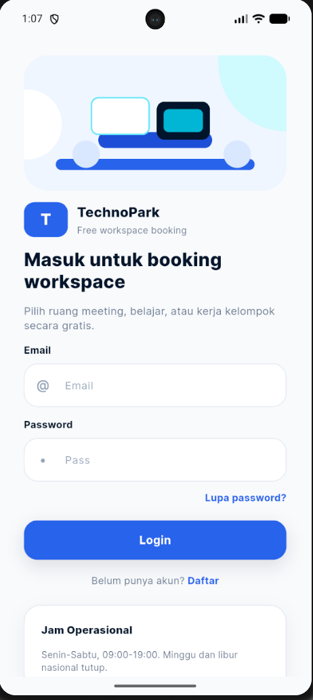

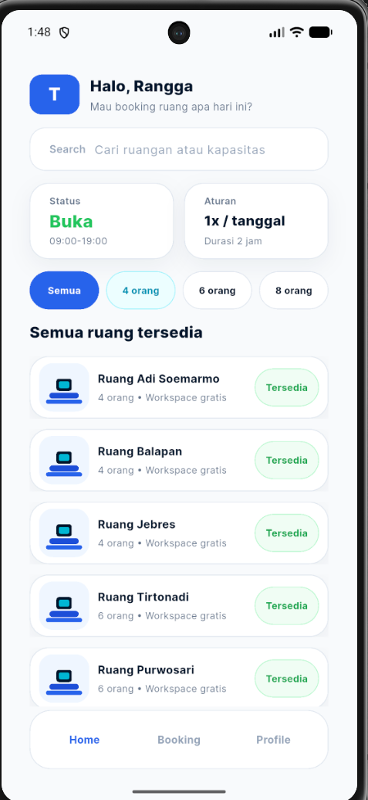

### 2. Software Architecture MVC

Tujuan: membuktikan project menerapkan pemisahan tanggung jawab.

Implementasi:

- `models/` menyimpan struktur data seperti `AppUser`, `Room`, dan `Booking`.
- `views/screens/` menyimpan tampilan layar aplikasi.
- `controllers/` menyimpan logic dan state aplikasi.
- `services/` menyimpan logic teknis seperti API, secure storage, dan notification.

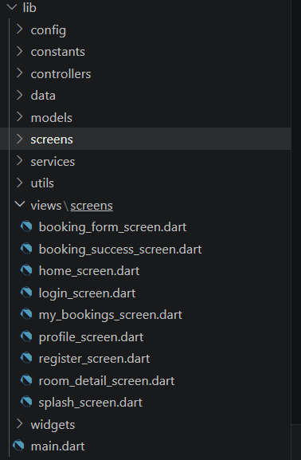

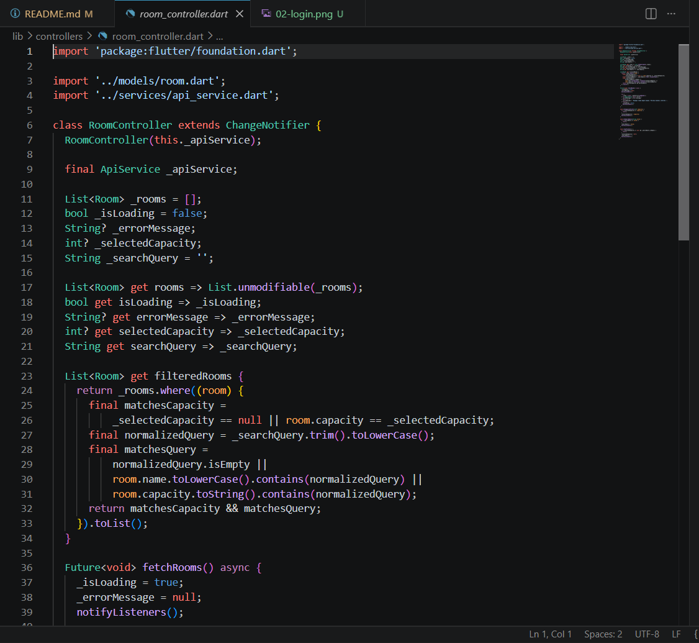

### 3. Provider State Management

Tujuan: membuktikan perubahan state memperbarui UI.

Implementasi:

- `AuthController` mengatur login, register, logout, dan session.
- `RoomController` mengatur loading room, error, search, dan capacity filter.
- `BookingController` mengatur form booking, validasi, submit, dan daftar booking.

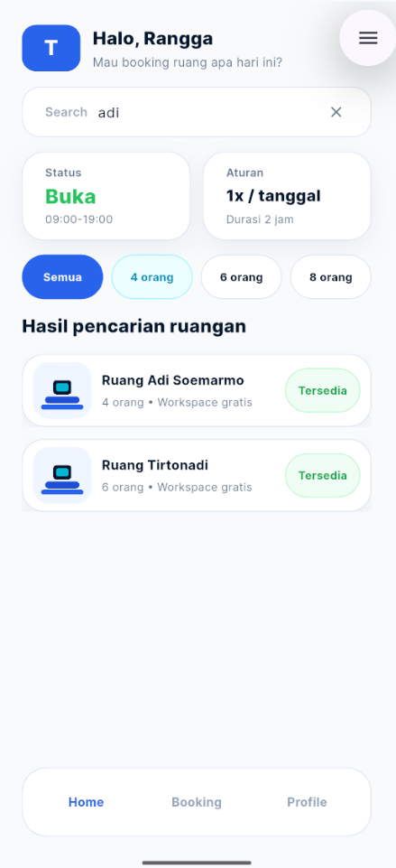


### 4. REST API Integration

Tujuan: membuktikan aplikasi mengambil dan mengirim data melalui API.

Implementasi:

- Home Screen memanggil `GET /rooms`.
- My Bookings memanggil `GET /bookings`.
- Booking Form memanggil `POST /bookings`.
- Cancel booking memanggil `DELETE /bookings/{id}`.

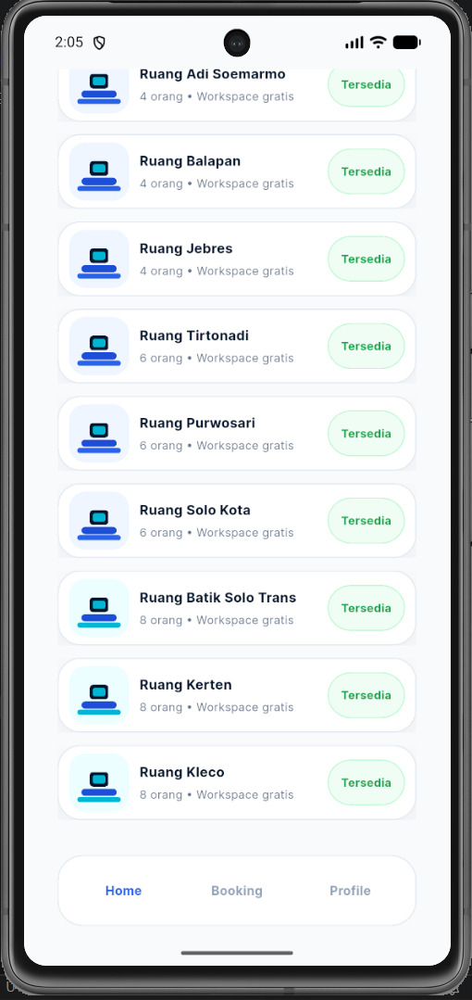

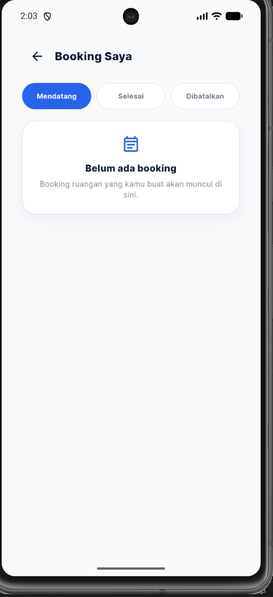

### 5. Secure Storage

Tujuan: membuktikan session login tersimpan secara lokal.

Implementasi:

- `flutter_secure_storage` menyimpan registered local accounts.
- `flutter_secure_storage` menyimpan active user session.
- Splash Screen membaca session dan mengarahkan user ke Home atau Login.

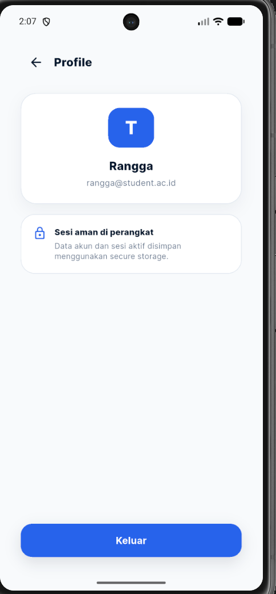

### 6. Local Notification

Tujuan: membuktikan aplikasi memakai fitur perangkat mobile.

Implementasi:

- Setelah booking berhasil, aplikasi menampilkan notifikasi `Booking TechnoPark berhasil`.
- Untuk booking masa depan, aplikasi menjadwalkan reminder 30 menit sebelum booking dimulai.
- Jika booking dibatalkan, reminder ikut dibatalkan.

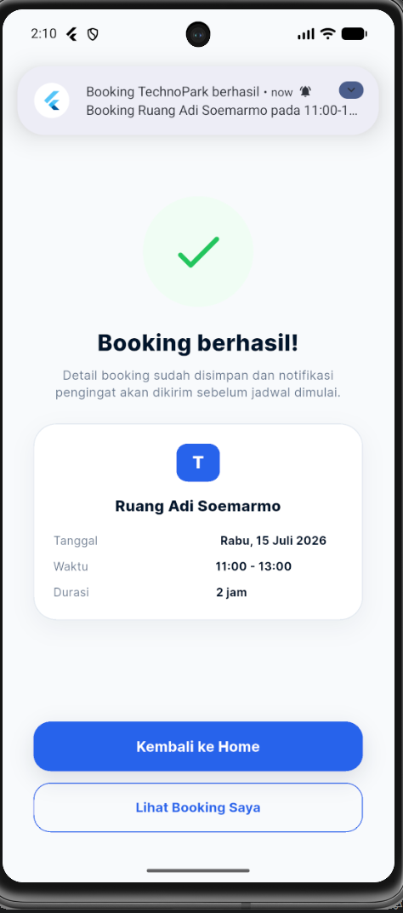

### 7. Booking Validation

Tujuan: membuktikan aturan booking diterapkan.

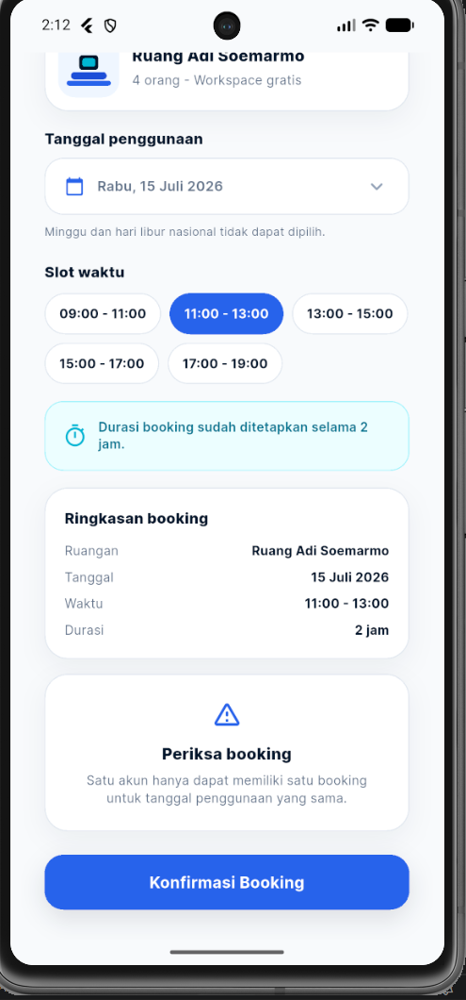

### 8. My Bookings

Tujuan: membuktikan daftar booking user berasal dari API.

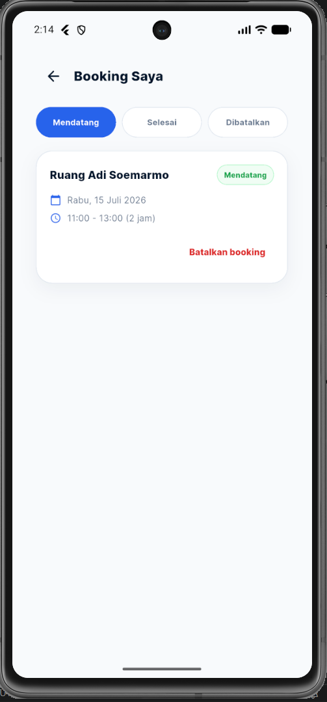

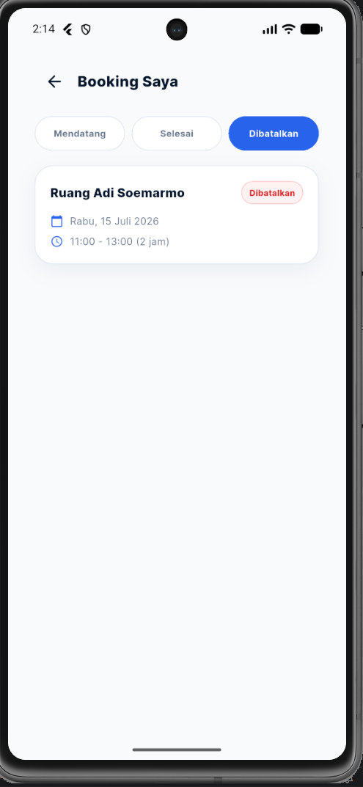

## Known Limitations

- A real MockAPI URL is still required for room and booking data.
- National holiday dates are locally maintained.
- MockAPI is not a production transaction-locking backend.
- Cancellation requires DELETE support from the configured API.
- Notification and exact-alarm behavior varies by Android version.
